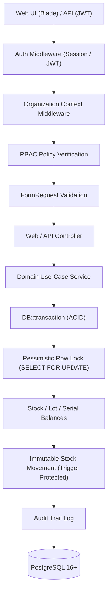

# System Architecture Document

## 1. Overview & Core Philosophy
The **Laravel 12 Stock Management Prototype** is architected to guarantee ACID transactional guarantees, pessimistic concurrency control, multi-tenant organization isolation, and immutable ledger record-keeping.



---

## 2. Layered Module Structure (`nwidart/laravel-modules`)

The system is decoupled into three non-circular modules:

```text
AuthenticationAudit
        ↑
MasterData
        ↑
InventoryTransaction
```

### Module 1: `AuthenticationAudit`
- **Responsibilities:** User Identity, JWT Authentication, Multi-Organization Membership, Dynamic RBAC (Owner, Admin, Manager, Staff), Security Policies, Request-scoped Organization Context Singleton, and Immutable Audit Trail Logs.

### Module 2: `MasterData`
- **Responsibilities:** Categories, Brands, Units of Measure, Products, Goods (SKUs), Suppliers, Warehouses, and Multi-level Warehouse Locations (Zone/Aisle/Rack/Shelf/Bin).
- **Isolation:** Every master entity strictly belongs to an `organization_id`.

### Module 3: `InventoryTransaction`
- **Responsibilities:** Stock Balances, Lot Tracking with Expirations, Piece-level Serial Numbers, Document Workflow State Machine (`DRAFT` $\rightarrow$ `PENDING` $\rightarrow$ `APPROVED` $\rightarrow$ `POSTED` $\rightarrow$ `REVERSED`), Pessimistic Concurrency Engine, Stock Reservations (`ACTIVE` $\rightarrow$ `CONSUMED` / `RELEASED` / `EXPIRED`), Compensating Reversals, Idempotency Processing, and Immutable Stock Movement Ledger.

---

## 3. Global Lock Ordering to Prevent Deadlocks

To eliminate deadlock conditions across concurrent transactions, row-level locks are always acquired in deterministic order:

1. **Stock Document:** `StockDocument::where('id', $id)->lockForUpdate()->first()`
2. **Stock Balances:** Sorted ascending by `goods_id`, `warehouse_id`, `location_id`
3. **Stock Lot Balances:** Sorted ascending by `lot_id`, `warehouse_id`, `location_id`
4. **Serial Numbers:** Sorted ascending by `id` / `serial_no`
5. **Stock Reservations:** Sorted ascending by `id`
