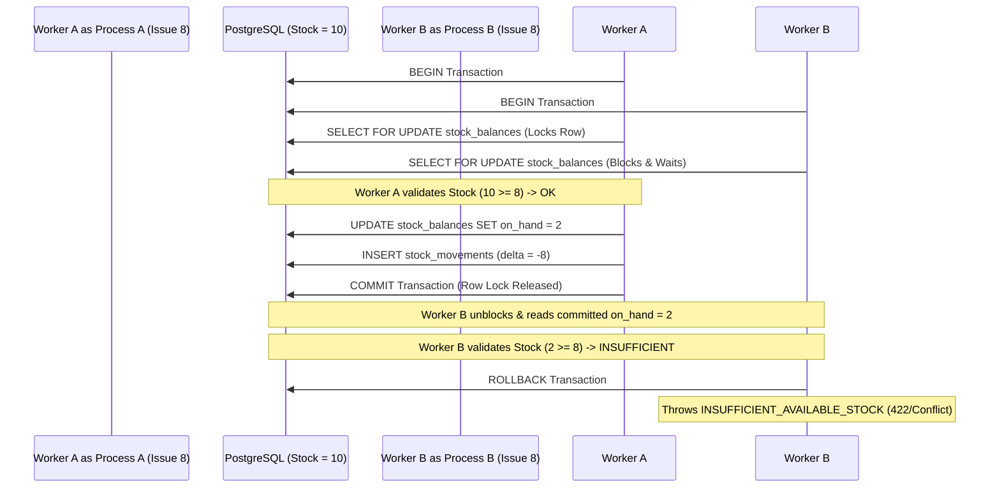

# Concurrency Control & Race Condition Protection

## 1. The Core Concurrency Problem

When two or more requests simultaneously attempt to issue stock when available quantity is limited:
- **Scenario:** Initial Stock = 10 units.
- **Concurrent Request A:** Issue 8 units.
- **Concurrent Request B:** Issue 8 units.
- **Unprotected Outcome (Lost Update / Negative Stock):** Both requests read `on_hand = 10`, both pass validation, both deduct 8, leading to `on_hand = -6` (Corrupted Inventory State).

---

## 2. Pessimistic Locking Solution

The system solves this with strict **PostgreSQL Pessimistic Row Locking (`SELECT ... FOR UPDATE`)**:

---

## 3. Automated Concurrency Test Proofs

| Concurrency Scenario | Tested Worker Mechanism | Result | Final Invariant |
| :--- | :--- | :--- | :--- |
| **Primary Race Condition** | 2 parallel PHP worker processes with independent DB connections | Exactly 1 `SUCCESS`, exactly 1 `INSUFFICIENT_AVAILABLE_STOCK` | Final Stock = 2.0000, Total Movements = -8.0000 |
| **Concurrent Transfer** | 2 parallel workers (A $\rightarrow$ B 30, B $\rightarrow$ A 40) | Both `SUCCESS` | Total System Stock conserved (100+100 = 110+90 = 200) |
| **Concurrent Row Creation** | 2 parallel receives on non-existing balance | Both `SUCCESS` | Exactly 1 `stock_balances` row created with `on_hand = 30` |
| **Concurrent Serial Duplicate** | 2 parallel receives with identical serial string | 1 `SUCCESS`, 1 `SERIAL_NUMBER_ALREADY_EXISTS` | Exactly 1 serial row created; failing worker rolls back |
| **Double Post** | Same document posted concurrently with different keys | 1 `SUCCESS`, 1 `DOCUMENT_ALREADY_POSTED` | Stock deducted exactly once |
