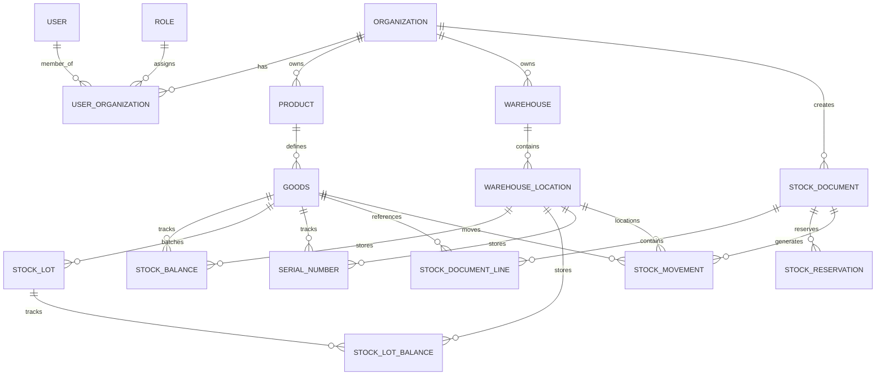

# Database Architecture & Entity-Relationship Model

## 1. Relational Schema Summary

The database uses PostgreSQL native features including UUID primary keys, composite unique constraints, PostgreSQL CHECK constraints, and PL/pgSQL database triggers for immutability.

### A. Authentication & Organization
- `users`: User credentials, status, profile
- `organizations`: Tenant entities (UUID primary keys)
- `roles`: Role definitions (`OWNER`, `ADMIN`, `MANAGER`, `STAFF`)
- `user_organizations`: Pivot table binding User + Organization + Role
- `audit_logs`: Immutable security audit trail with pre/post JSON diffs

### B. Master Data
- `categories`, `brands`, `units`: Product taxonomies and UoM
- `products`: Abstract catalog items
- `goods`: Concrete SKUs with tracking flags (`is_lot_tracked`, `is_serial_tracked`)
- `suppliers`, `goods_suppliers`: Vendor associations
- `warehouses`, `warehouse_locations`: Physical hierarchy

### C. Inventory Operations & Ledger
- `stock_balances`: Operational state (`on_hand`, `reserved`, `available = on_hand - reserved`)
- `stock_lots`, `stock_lot_balances`: Lot batches, expiration dates, lot operational balances
- `serial_numbers`: Piece-level serial tracking with status (`IN_STOCK`, `RESERVED`, `ISSUED`, `REVERSED`, `DAMAGED`)
- `stock_documents`, `stock_document_lines`, `stock_document_line_serials`: Workflow transaction definitions
- `stock_reservations`: Temporary allocated stock holding
- `stock_movements`: Append-only immutable historical stock ledger (protected by DB trigger)
- `idempotency_keys`: Unique transaction request keys with response cache

---

## 2. Entity-Relationship Diagram (ERD)

