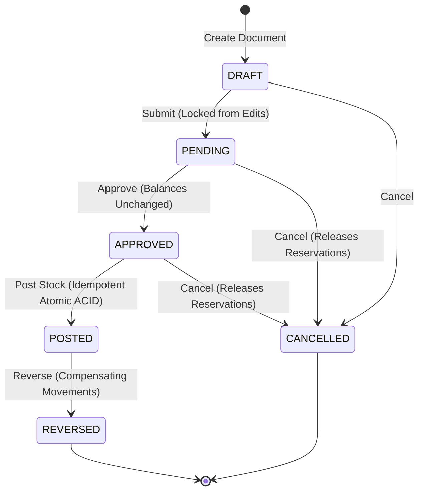

# Transaction Flow & State Machine

## 1. Document Lifecycle State Machine

---

## 2. Posting Execution Flows

### A. RECEIVE Transaction
1. Acquire Row Lock on Document & verify status is `APPROVED`.
2. For each line:
   - For standard goods: Increment `stock_balances.on_hand` by $+Q$.
   - For lot goods: Create or update `stock_lots`, increment `stock_lot_balances.on_hand` by $+Q$.
   - For serial goods: Create `serial_numbers` rows with status `IN_STOCK`.
   - Record `StockMovement` with type `RECEIVE` and delta $+Q$.
3. Transition Document status to `POSTED`, set `posted_by` and `posted_at`.
4. Record Audit Log.

### B. ISSUE Transaction
1. Acquire Row Lock on Document & verify status is `APPROVED`.
2. For each line:
   - Calculate available quantity: $\text{available} = \text{on\_hand} - \text{reserved}$.
   - If unreserved: verify $\text{available} \ge Q$. Deduct `stock_balances.on_hand` by $-Q$.
   - If reserved: decrement `stock_balances.on_hand` by $-Q$, decrement `stock_balances.reserved` by $-Q$, mark reservation `CONSUMED`.
   - For lot goods: verify lot not expired and lot $\text{on\_hand} \ge Q$. Deduct `stock_lot_balances.on_hand` by $-Q$.
   - For serial goods: verify serials `IN_STOCK` or `RESERVED`, update status to `ISSUED` and clear location.
   - Record `StockMovement` with type `ISSUE` and delta $-Q$.
3. Transition Document status to `POSTED`, set `posted_by` and `posted_at`.
4. Record Audit Log.

### C. TRANSFER Transaction
1. Acquire Row Lock on Document & verify status is `APPROVED`.
2. Lock Source & Destination balances in deterministic sorted order.
3. Verify Source $\text{available} \ge Q$.
4. Deduct Source `on_hand` by $-Q$, record `TRANSFER_OUT` movement.
5. Increment Destination `on_hand` by $+Q$, record `TRANSFER_IN` movement.
6. For serial goods: update serial location to Destination.
7. Transition Document status to `POSTED`.

### D. ADJUSTMENT Transaction
1. Acquire Row Lock on Document.
2. Read physical counted quantity and compare with current `on_hand`:
   - If Count > Current: Delta $= +(\text{Count} - \text{Current})$, increment balance, record `ADJUST_IN` movement.
   - If Count < Current: Delta $= -(\text{Current} - \text{Count})$, decrement balance, record `ADJUST_OUT` movement.
   - If Count == Current: Delta $= 0$, balance unchanged, zero movement recorded.
3. Transition Document status to `POSTED`.

### E. REVERSAL Transaction (Compensating)
1. Verify user role is `OWNER` or `ADMIN`.
2. Lock original `POSTED` document and verify it is not already reversed.
3. For Receive reversal: Verify available stock $\ge Q$. Deduct balance by $-Q$, insert compensating movement, mark serials `REVERSED`.
4. For Issue reversal: Increment balance by $+Q$, insert compensating movement, return serials to `IN_STOCK`.
5. For Transfer reversal: Verify destination has sufficient stock, deduct destination, restore source, insert compensating movements.
6. Transition original document status to `REVERSED`, create linked reversal document in `POSTED` status.
